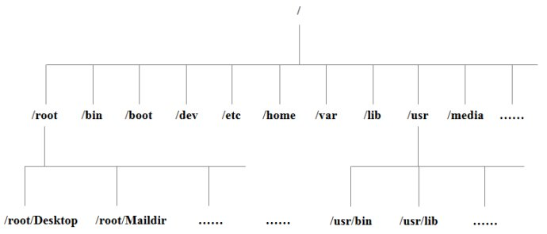

## 文件系统 ##
文件系统是我们使用电脑时最常用的模块，双击查看、Ctrl CV都是对文件系统的操作。
  
上图是从根目录开始的Linux目录结构，下面简单介绍一些比较重要的目录。  

- **bin 链接文件链接到/usr/bin 存放所有用户通用的命令**
- boot 系统引导时使用的文件
- **etc 系统的配置文件**
- **home 用户文件，每创建一个用户都会在这里生成一个相应的目录**
- lib 内核模块及各种应用程序的共享库
- **usr 已安装的应用程序文件，/usr/local中是本地管理员软件安装目录**
#### 一、文件查看命令ls ####
在Linux的命令行界面下，要想查看当前目录下有哪些文件或者查看某个文件的属性就需要用到ls命令，ls命令是list的缩写。

- 查看目录下的隐藏文件：ls -a

- 查看文件的详细信息：ls -l

  ```
    [root@VM_0_2_centos ~]# ls -l
    total 32
    drwxr-xr-x 2 root root 4096 Nov 13 10:18 Desktop
    drwxr-xr-x 2 root root 4096 Nov 13 10:18 Documents
    drwxr-xr-x 2 root root 4096 Nov 13 10:18 Downloads
    drwxr-xr-x 2 root root 4096 Nov 13 10:18 Music
    drwxr-xr-x 2 root root 4096 Nov 13 10:18 Pictures
    drwxr-xr-x 2 root root 4096 Nov 13 10:18 Public
    drwxr-xr-x 2 root root 4096 Nov 13 10:18 Templates
    drwxr-xr-x 2 root root 4096 Nov 13 10:18 Videos
  ```
  
  第一个字符代表这个文件是**(d)目录**、**(-)文件**或**(l)链接文件**等等。
  
  接下来九个字符表示文件权限，三个为一组。分别是**(r)读权限**、**(w)写权限**、**(x)执行权限**，如果没有对应的权限则用**(-)**替代。第一组表明所属用户的权限，第二组是同组用户的权限，最后一组是其它用户的权限。
  
  后面的数字2表示文件被引用的次数。
  
  第一个root表示所属用户，第二个表示所属组。
  
  4096代表文件的大小。我们可以结合-h选项使用，4096就会显示为4.0k。

#### 二、文件创建命令mkdir、touch

在Linux中，创建文件和创建文件夹需要使用不同的命令。

mkdir用于创建文件夹，touch用来创建文件，需要注意的是，当我们进行递归创建文件夹时需要添加-p选项，不然会报错。

```
[root@VM_0_2_centos ~]# mkdir mkdir test1/test2
mkdir: cannot create directory ‘test1/test2’: No such file or directory
[root@VM_0_2_centos ~]# mkdir -p test1/test2
[root@VM_0_2_centos ~]# ls 
Desktop  Documents  Downloads  mkdir  Music  Pictures  Public  Templates  test1  Videos
```

mkdir和touch命令都可以同时创建多个文件夹或文件，只需要用空格进行分隔。

#### 三、文件复制粘贴删除操作

1. cp copy的缩写，用来复制文件。只需要在命令后添加源地址和复制到的地址即可。

   ```
   [root@VM_0_2_centos ~]# ls test1
   test2  txt
   [root@VM_0_2_centos ~]# cp test1/txt txt
   [root@VM_0_2_centos ~]# ls
   Desktop  Documents  Downloads  mkdir  Music  Pictures  Public  Templates  test1  txt  Videos
   ```

   cp也可以用于复制目录，只需要添加-r选项即可。

   ```
   [root@VM_0_2_centos ~]# ls test1
   test2  txt
   [root@VM_0_2_centos ~]# cp -r test1 test3
   [root@VM_0_2_centos ~]# ls
   Desktop  Documents  Downloads  mkdir  Music  Pictures  Public  Templates  test1  test3  txt  Videos
   [root@VM_0_2_centos ~]# ls test3
   test2  txt
   ```

2. mv move的缩写，用来剪切文件。和复制类似，但是剪切文件夹时不需要添加-r选项。

3. rm remove的缩写，用来删除文件。删除文件时系统会进行确认，添加-f选项可以取消确认。

   ```
   root@VM_0_2_centos ~]# rm /txt
   rm: remove regular empty file ‘/txt’? n
   [root@VM_0_2_centos ~]# rm -f /txt
   [root@VM_0_2_centos ~]# ls /
   bin  boot  data  dev  etc  home  lib  lib64  lost+found  media  mnt  opt  proc  root  run  sbin  srv  sys  test1  tmp  usr  var
   ```

   删除文件夹时需要添加-r选项。

#### 四、更改文件的详细信息 ####

在模块一中，我们讲述了用ls -l命令来查看文件的详细属性，这节就来讲讲如何更改文件的详细信息。

```
[root@VM_0_2_centos ~]# ls -l txt
-rw-r--r-- 1 root root 0 Nov 21 09:28 txt
```

1. chmod 修改文件的权限。

   chmod 是 change model 的缩写，它有两种改变文件权限的方式。

   一是使用数字表示法，数字4代表r，数字2代表w，数字1代表x。

   ```
   [root@VM_0_2_centos ~]# chmod 777 txt
   [root@VM_0_2_centos ~]# ls -l txt
   -rwxrwxrwx 1 aa aa 0 Nov 21 09:28 txt
   ```

   二是使用字母表示法，字母ugo对应着所属用户、同组用户、其它用户，字符+-=代表要添加、减少、设置某个权限。

   ```
   [root@VM_0_2_centos ~]# chmod u=rwx,g-x,o-wx txt
   [root@VM_0_2_centos ~]# ls -l txt
   -rwxrw-r-- 1 aa aa 0 Nov 21 09:28 txt
   ```

2. chgrp、chown修改文件的所属用户、所属组。

   首先需要添加一个新用户，使用useradd 用户名命令。

   ```
   [root@VM_0_2_centos ~]# chgrp aa txt
   [root@VM_0_2_centos ~]# ls -l txt
   -rwxrw-r-- 1 root aa 0 Nov 21 09:28 txt
   [root@VM_0_2_centos ~]# chown aa txt
   [root@VM_0_2_centos ~]# ls -l txt
   -rwxrw-r-- 1 aa aa 0 Nov 21 09:28 txt
   ```

#### 五、查找文件

- find命令

  find命令等于在windows操作系统中点击文件夹在右上角进行搜索。

  find命令的格式：find [搜索范围] [搜索条件]

  搜索条件就是命令的选项，find命令的搜索条件很多，下面列举几个常用的。

  1. -name 文件名
  2. -size 文件大小（以数据块为单位，1k等于2数据块。可以和+-符号连用，+表示大于多少-表示小于多少）
  3. -user 所属用户
  4. -group 所属组
  5. -type 文件类型（ d：代表目录、f：代表文件、l：代表软链接 ）
  6. -amin 访问时间
  7. -cmin 属性修改时间
  8. -mmin 文件内容修改时间

  ```
  [root@VM_0_2_centos ~]# find /root -name tx?
  /root/txt
  [root@VM_0_2_centos ~]# find /root -name tx? -a -size +100
  [root@VM_0_2_centos ~]# find /root -name tx? -a -user aa
  /root/txt
  [root@VM_0_2_centos ~]# find /root -name tx? -a -user aa -a -group aa
  /root/txt
  [root@VM_0_2_centos ~]# find /root -name tx? -a -type f
  /root/txt
  ```

- locate命令

  locate命令是**在一个类似操作日志的资料库中**进行查找，所以查找速度比find命令要快。但是locate资料库并**不是针对全部文件夹**的。

  locate命令格式：locate  文件名

  locate是定期更新的，在新建一个文件后使用locate可能会搜索不到。可是手动输入updatedb来进行更新资料库。

- which

  which用来查看命令所在路径。

  which命令格式：which 命令

- whereis

  whereis和which类似，但在查找命令位置的同时还会将命令文档所在位置显示出来。

  whereis命令格式：whereis 命令